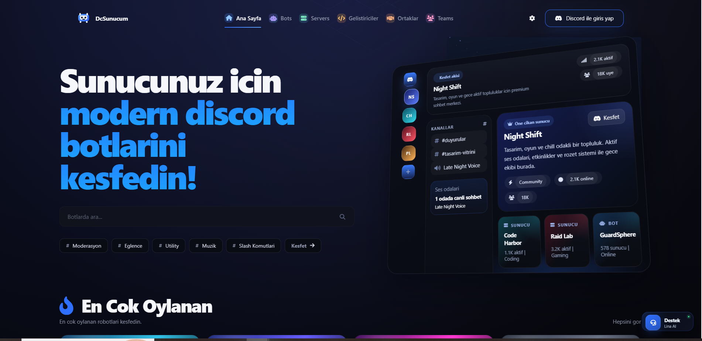
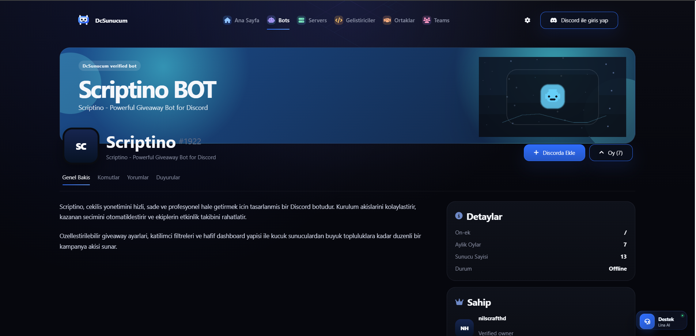
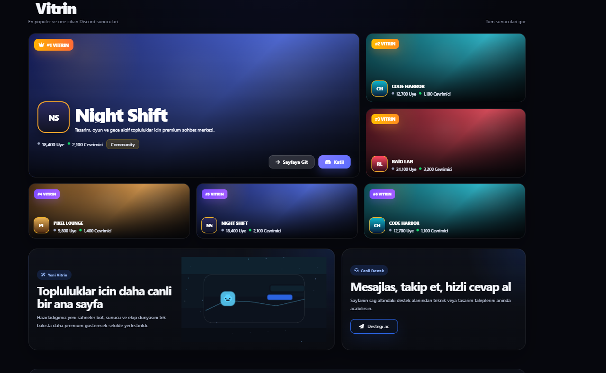
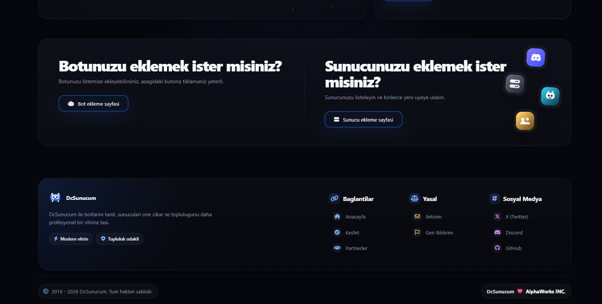
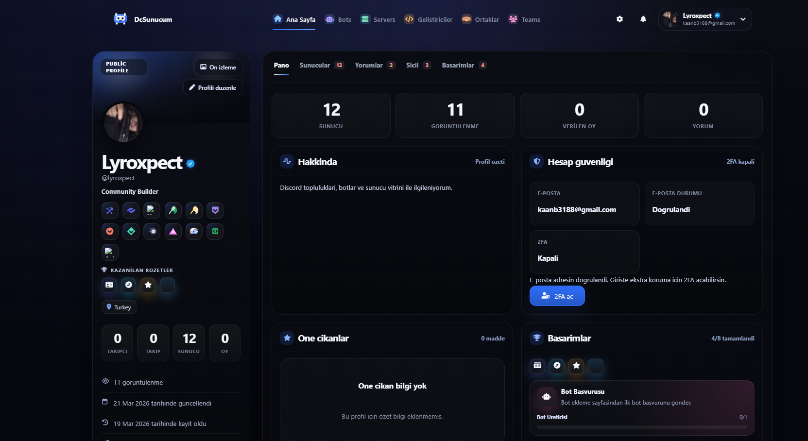

# 🚀 Discord Bot List

A modern and customizable Discord bot listing platform.

---

## 📸 Demo

## 🌟 30 Stars = Public Release

When this project hits **30 ⭐**, it will be officially shared and actively maintained with new updates.

⭐ Star the repo to support the project!

  
  
  

  
  

---

## 👨‍💻 Developers

<table>
   <tr>
      <td align="center">
        <a href="https://github.com/clqu">
          
           
          <b>clqu</b>
        </a>
      </td>
      <td align="center">
        <a href="https://github.com/lyroxpect">
          
           
          <b>Lyrox</b>
        </a>
      </td>
   </tr>
</table>

---

## 📜 Terms of Use

- You have the permission to shoot and share videos, but you must mention us and our server.
- You cannot use our branding anywhere on your site or claim it as your own.
- You may share written content, but you must mention us and our server.
- Do not speak in a "we did it" way.
- You cannot sell this project.
- Do not modify the footer below.

---

## ⭐ Support

If you like this project, consider giving it a ⭐ on GitHub!
